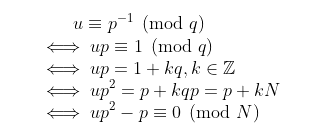

# FCSC 2020 : Habemus Clavem Corrumpere

### Par SushiMaki
#  
**Catégorie :** Crypto / forensics  
**Points :** 500 (score dynamique)  
**Solves :** 12  
**Description :**
>On vous demande d’analyser a posteriori une page mémoire extraite d’une machine compromise.
Beaucoup de données ont été effacées, mais il est primordial pour votre interlocuteur de récupérer un flag qu'il était sur le point de déchiffrer.

* __fichier__ : `mempage.bin`

## Write-up

* ### Extraction de la clé corrompue et du flag chiffré

Nous disposons uniquement de fichier `mempage.bin`, qui, selon la description du challenge, doit être une page mémoire. Tentons d'y extraire des fichiers : la commande `binwalk --dd=".*" mempage.bin -e` nous donne le résultat suivant :
```
DECIMAL       HEXADECIMAL     DESCRIPTION
--------------------------------------------------------------------------------
1337          0x539           Private key in DER format (PKCS header length: 4, sequence length: 605
2758          0xAC6           Zip archive data, at least v1.0 to extract, compressed size: 128, uncompressed size: 128, name: flag.txt.enc
3038          0xBDE           End of Zip archive
```
ce qui indique la présence de 3 fichiers dans la page mémoire, qui ont été extraits par `binwalk` dans le répertoire `_mempage.bin.extracted`.\
Il y a d'abord le fichier `flag.txt.enc` qui, comme son nom l'indique, contient très probablement le flag chiffré. Il y a ensuite le fichier `539.key`, et un simple `file 539.key` donne la sortie `539.key: DER Encoded Key Pair, 1024 bits`, qui montre que c'est une clé privée RSA encodée en DER de 1024 bits.\
Le fichier `BDE` semble être seulement une mauvaise interprétation de `binwalk` puisque celui-ci est quasiment entièrement rempli de null-bytes.
Enfin l'archive `AC6.zip` ne contient que le fichier `flag.txt.enc`, et qui est le même (après vérification par somme de contrôle AKA checksum) que le `flag.txt.enc` déjà traité.\
Les deux seuls fichiers intéressants sont donc le flag chiffré `flag.txt.enc` et la clé privée RSA `539.key` qui permet sans-doute de le déchiffrer. Malheureusement cette clé est corrompue, comme on va le voir par la suite.

* ### Extraction des paramètres N, e et u de la clé privée corrompue

Rapidement, on se rend compte que la clé `539.key` est corrompue : la commande `openssl asn1parse -in 539.key -inform DER` qui permet de parser une clé encodée en DER au format ASN.1 retourne une erreur.
Un `xxd 539.key` permet d'afficher le dump hexadécimal de la clé :
```
00000000: 3082 025d 0201 0002 8181 00c1 8a65 87d0  0..].........e..
00000010: 5c9d 13e1 f9df 29ce a97d dce1 0950 ad2f  \.....)..}...P./
00000020: ffc8 9894 6245 3ee0 56f6 6693 50fe 9c8c  ....bE>.V.f.P...
00000030: eee1 32e1 9ad9 0661 45b1 9134 03c2 c66d  ..2....aE..4...m
00000040: 5380 0e57 fe87 80e6 3de9 f423 6599 1883  S..W....=..#e...
00000050: c876 29a4 5816 1ea5 b9ce 19f2 a263 874f  .v).X........c.O
00000060: 58b0 0676 19d4 b577 25d0 d8e6 9476 9186  X..v...w%....v..
00000070: d2e2 ebc2 aa83 060a f82f f617 011d 330c  ........./....3.
00000080: 3476 c072 c93a db44 26a9 8702 0301 0001  4v.r.:.D&.......
00000090: 0000 0000 0000 0000 0000 0000 0000 0000  ................
000000a0: 0000 0000 0000 0000 0000 0000 0000 0000  ................
000000b0: 0000 0000 0000 0000 0000 0000 0000 0000  ................
000000c0: 0000 0000 0000 0000 0000 0000 0000 0000  ................
000000d0: 0000 0000 0000 0000 0000 0000 0000 0000  ................
000000e0: 0000 0000 0000 0000 0000 0000 0000 0000  ................
000000f0: 0000 0000 0000 0000 0000 0000 0000 0000  ................
00000100: 0000 0000 0000 0000 0000 0000 0000 0000  ................
00000110: 0000 0002 4100 c6a1 1d00 0000 0000 0000  ....A...........
00000120: 0000 0000 0000 0000 0000 0000 0000 0000  ................
00000130: 0000 0000 0000 0000 0000 0000 0000 0000  ................
00000140: 0000 0000 0000 0000 0000 0000 0000 0000  ................
00000150: 0000 0000 0000 0000 0000 0000 0000 0000  ................
00000160: 0000 0000 0000 0000 0000 0000 0000 0000  ................
00000170: 0000 0000 0000 0000 0000 0000 0000 0000  ................
00000180: 0000 0000 0000 0000 0000 0000 0000 0000  ................
00000190: 0000 0000 0000 0000 0000 0000 0000 0000  ................
000001a0: 0000 0000 0000 0000 0000 0000 0000 0000  ................
000001b0: 0000 0000 0000 0000 0000 0000 0000 0000  ................
000001c0: 0000 0000 0000 0000 0000 0000 0000 0000  ................
000001d0: 0000 0000 0000 0000 0000 0000 0000 0000  ................
000001e0: 0000 0000 0000 0000 0000 0000 0000 0000  ................
000001f0: 0000 0000 0000 0000 0000 0000 0000 0000  ................
00000200: 0000 0000 0000 0000 0000 0000 0000 0000  ................
00000210: 0000 0000 0000 0000 0000 0000 0000 0002  ................
00000220: 4037 e35b 36ab e493 5aef 71be bcbc 1eb9  @7.[6...Z.q.....
00000230: 56db bdd4 fc22 14bb 2e09 a8bc 45ad 3ccd  V...."......E.<.
00000240: 565a 192b f04e 4c27 6d5d 4174 43a2 e81a  VZ.+.NL'm]AtC...
00000250: eacc fafd 20c3 5634 7c72 901a d549 7de8  .... .V4|r...I}.
00000260: 3b00 0000 0000 0000 0000 0000 0000 0000  ;...............
00000270: 0000 0000 0000 0000 0000 0000 0000 0000  ................
00000280: 0000 0000 0000 0000 0000 0000 0000 0000  ................
00000290: 0000 0000 0000 0000 0000 0000 0000 0000  ................
000002a0: 0000 0000 0000 0000 0000 0000 0000 0000  ................
000002b0: 0000 0000 0000 0000 0000 0000 0000 0000  ................
000002c0: 0000 0000 0000 0000 0000 0000 0000 0000  ................
000002d0: 0000 0000 0000 0000 0000 0000 0000 0000  ................
000002e0: 0000 0000 0000 0000 0000 0000 0000 0000  ................
000002f0: 0000 0000 0000 0000 0000 0000 0000 0000  ................
00000300: 0000 0000 0000 0000 0000 0000 0000 0000  ................
00000310: 0000 0000 0000 0000 0000 0000 0000 0000  ................
00000320: 0000 0000 0000 0000 0000 0000 0000 0000  ................
00000330: 0000 0000 0000 0000 0000 0000 0000 0000  ................
00000340: 0000 0000 0000 0000 0000 0000 0000 0000  ................
00000350: 0000 0000 0000 0000 0000 0000 0000 0000  ................
00000360: 0000 0000 0000 0000 0000 0000 0000 0000  ................
00000370: 0000 0000 0000 0000 0000 0000 0000 0000  ................
00000380: 0000 0000 0000 0000 0000 0000 0000 0000  ................
00000390: 0000 0000 0000 0000 0000 0000 0000 0000  ................
000003a0: 0000 0000 0000 0000 0000 0000 0000 0000  ................
000003b0: 0000 0000 0000 0000 0000 0000 0000 0000  ................
000003c0: 0000 0000 0000 0000 0000 0000 0000 0000  ................
000003d0: 0000 0000 0000 0000 0000 0000 0000 0000  ................
000003e0: 0000 0000 0000 0000 0000 0000 0000 0000  ................
000003f0: 0000 0000 0000 0000 0000 0000 0000 0000  ................
00000400: 0000 0000 0000 0000 0000 0000 0000 0000  ................
00000410: 0000 0000 0000 0000 0000 0000 0000 0000  ................
00000420: 0000 0000 0000 0000 0000 0000 0000 0000  ................
00000430: 0000 0000 0000 0000 0000 0000 0000 0000  ................
00000440: 0000 0000 0000 0000 0000 0000 0000 0000  ................
00000450: 0000 0000 0000 0000 0000 0000 0000 0000  ................
00000460: 0000 0000 0000 0000 0000 0000 0000 0000  ................
00000470: 0000 0000 0000 0000 0000 0000 0000 0000  ................
00000480: 0000 0000 0000 0000 0000 0000 0000 0000  ................
00000490: 0000 0000 0000 0000 0000 0000 0000 0000  ................
000004a0: 0000 0000 0000 0000 0000 0000 0000 0000  ................
000004b0: 0000 0000 0000 0000 0000 0000 0000 0000  ................
000004c0: 0000 0000 0000 0000 0000 0000 0000 0000  ................
000004d0: 0000 0000 0000 0000 0000 0000 0000 0000  ................
000004e0: 0000 0000 0000 0000 0000 0000 0000 0000  ................
000004f0: 0000 0000 0000 0000 0000 0000 0000 0000  ................
00000500: 0000 0000 0000 0000 0000 0000 0000 0000  ................
00000510: 0000 0000 0000 0000 0000 0000 0000 0000  ................
00000520: 0000 0000 0000 0000 0000 0000 0000 0000  ................
00000530: 0000 0000 0000 0000 0000 0000 0000 0000  ................
00000540: 0000 0000 0000 0000 0000 0000 0000 0000  ................
00000550: 0000 0000 0000 0000 0000 0000 0000 0000  ................
00000560: 0000 0000 0000 0000 0000 0000 0000 0000  ................
00000570: 0000 0000 0000 0000 0000 0000 0000 0000  ................
00000580: 0000 0000 0000 0000 0000 0000 0050 4b03  .............PK.
00000590: 040a 0000 0000 00e5 4e79 50b2 e71c 5280  ........NyP...R.
000005a0: 0000 0080 0000 000c 001c 0066 6c61 672e  ...........flag.
000005b0: 7478 742e 656e 6355 5409 0003 6d1c 7b5e  txt.encUT...m.{^
000005c0: 911c 7b5e 7578 0b00 0104 f501 0000 0414  ..{^ux..........
000005d0: 0000 001a c3c6 60ff b584 0ce4 0895 cd74  ......`........t
000005e0: 0aa2 5a80 7b82 2d6c 0202 125f c218 63ef  ..Z.{.-l..._..c.
000005f0: af92 854b 8165 2d15 53d6 6993 912a 1d39  ...K.e-.S.i..*.9
00000600: 5d86 d013 9c5b 4a13 9c73 580b d84f 18b7  ]....[J..sX..O..
00000610: 0e85 b2a3 78d2 395f fee9 e518 8e73 47ac  ....x.9_.....sG.
00000620: 9ea6 7d1d 30f5 7862 4039 c7f1 3193 ea68  ..}.0.xb@9..1..h
00000630: d7bf 4fe5 99d2 1296 e0d7 4db4 ef3e 367b  ..O.......M..>6{
00000640: 0804 3a93 06f5 3b52 a83b b37c 4f05 cddd  ..:...;R.;.|O...
00000650: 03ea c350 4b01 021e 030a 0000 0000 00e5  ...PK...........
00000660: 4e79 50b2 e71c 5280 0000 0080 0000 000c  NyP...R.........
00000670: 0018 0000 0000 0000 0000 00a4 8100 0000  ................
00000680: 0066 6c61 672e 7478 742e 656e 6355 5405  .flag.txt.encUT.
00000690: 0003 6d1c 7b5e 7578 0b00 0104 f501 0000  ..m.{^ux........
000006a0: 0414 0000 0050 4b05 0600 0000 0001 0001  .....PK.........
000006b0: 0052 0000 00c6 0000 0000 0000 0000 0000  .R..............
000006c0: 0000 0000 0000 0000 0000 0000 0000 0000  ................
000006d0: 0000 0000 0000 0000 0000 0000 0000 0000  ................
000006e0: 0000 0000 0000 0000 0000 0000 0000 0000  ................
000006f0: 0000 0000 0000 0000 0000 0000 0000 0000  ................
00000700: 0000 0000 0000 0000 0000 0000 0000 0000  ................
00000710: 0000 0000 0000 0000 0000 0000 0000 0000  ................
00000720: 0000 0000 0000 0000 0000 0000 0000 0000  ................
00000730: 0000 0000 0000 0000 0000 0000 0000 0000  ................
00000740: 0000 0000 0000 0000 0000 0000 0000 0000  ................
00000750: 0000 0000 0000 0000 0000 0000 0000 0000  ................
00000760: 0000 0000 0000 0000 0000 0000 0000 0000  ................
00000770: 0000 0000 0000 0000 0000 0000 0000 0000  ................
00000780: 0000 0000 0000 0000 0000 0000 0000 0000  ................
00000790: 0000 0000 0000 0000 0000 0000 0000 0000  ................
000007a0: 0000 0000 0000 0000 0000 0000 0000 0000  ................
000007b0: 0000 0000 0000 0000 0000 0000 0000 0000  ................
000007c0: 0000 0000 0000 0000 0000 0000 0000 0000  ................
000007d0: 0000 0000 0000 0000 0000 0000 0000 0000  ................
000007e0: 0000 0000 0000 0000 0000 0000 0000 0000  ................
000007f0: 0000 0000 0000 0000 0000 0000 0000 0000  ................
00000800: 0000 0000 0000 0000 0000 0000 0000 0000  ................
00000810: 0000 0000 0000 0000 0000 0000 0000 0000  ................
00000820: 0000 0000 0000 0000 0000 0000 0000 0000  ................
00000830: 0000 0000 0000 0000 0000 0000 0000 0000  ................
00000840: 0000 0000 0000 0000 0000 0000 0000 0000  ................
00000850: 0000 0000 0000 0000 0000 0000 0000 0000  ................
00000860: 0000 0000 0000 0000 0000 0000 0000 0000  ................
00000870: 0000 0000 0000 0000 0000 0000 0000 0000  ................
00000880: 0000 0000 0000 0000 0000 0000 0000 0000  ................
00000890: 0000 0000 0000 0000 0000 0000 0000 0000  ................
000008a0: 0000 0000 0000 0000 0000 0000 0000 0000  ................
000008b0: 0000 0000 0000 0000 0000 0000 0000 0000  ................
000008c0: 0000 0000 0000 0000 0000 0000 0000 0000  ................
000008d0: 0000 0000 0000 0000 0000 0000 0000 0000  ................
000008e0: 0000 0000 0000 0000 0000 0000 0000 0000  ................
000008f0: 0000 0000 0000 0000 0000 0000 0000 0000  ................
00000900: 0000 0000 0000 0000 0000 0000 0000 0000  ................
00000910: 0000 0000 0000 0000 0000 0000 0000 0000  ................
00000920: 0000 0000 0000 0000 0000 0000 0000 0000  ................
00000930: 0000 0000 0000 0000 0000 0000 0000 0000  ................
00000940: 0000 0000 0000 0000 0000 0000 0000 0000  ................
00000950: 0000 0000 0000 0000 0000 0000 0000 0000  ................
00000960: 0000 0000 0000 0000 0000 0000 0000 0000  ................
00000970: 0000 0000 0000 0000 0000 0000 0000 0000  ................
00000980: 0000 0000 0000 0000 0000 0000 0000 0000  ................
00000990: 0000 0000 0000 0000 0000 0000 0000 0000  ................
000009a0: 0000 0000 0000 0000 0000 0000 0000 0000  ................
000009b0: 0000 0000 0000 0000 0000 0000 0000 0000  ................
000009c0: 0000 0000 0000 0000 0000 0000 0000 0000  ................
000009d0: 0000 0000 0000 0000 0000 0000 0000 0000  ................
000009e0: 0000 0000 0000 0000 0000 0000 0000 0000  ................
000009f0: 0000 0000 0000 0000 0000 0000 0000 0000  ................
00000a00: 0000 0000 0000 0000 0000 0000 0000 0000  ................
00000a10: 0000 0000 0000 0000 0000 0000 0000 0000  ................
00000a20: 0000 0000 0000 0000 0000 0000 0000 0000  ................
00000a30: 0000 0000 0000 0000 0000 0000 0000 0000  ................
00000a40: 0000 0000 0000 0000 0000 0000 0000 0000  ................
00000a50: 0000 0000 0000 0000 0000 0000 0000 0000  ................
00000a60: 0000 0000 0000 0000 0000 0000 0000 0000  ................
00000a70: 0000 0000 0000 0000 0000 0000 0000 0000  ................
00000a80: 0000 0000 0000 0000 0000 0000 0000 0000  ................
00000a90: 0000 0000 0000 0000 0000 0000 0000 0000  ................
00000aa0: 0000 0000 0000 0000 0000 0000 0000 0000  ................
00000ab0: 0000 0000 0000 0000 0000 0000 0000 0000  ................
00000ac0: 0000 0000 0000 00                        .......
```
Après une série de null-bytes `00`, à l'offset `00000580` commence un bloc où l'on peut retrouver la chaîne de caractères `flag.txt.enc`. Ainsi, ce bloc n'appartient en réalité pas à la clé, parce qu'il n'y a aucune raison de retrouver le nom de fichier du flag chiffré dans celle-ci. Il est bien plus probable que ce soit l'œuvre d'un mauvais parsing de `binwalk` ou bien de la corruption de la clé. Dans tous les cas on supprime ce bloc et les null-bytes le précédent pour arriver au résultat suivant (avec `xxd -ps 539.key`):
```
3082025d02010002818100c18a6587d05c9d13e1f9df29cea97ddce10950
ad2fffc8989462453ee056f6669350fe9c8ceee132e19ad9066145b19134
03c2c66d53800e57fe8780e63de9f42365991883c87629a458161ea5b9ce
19f2a263874f58b0067619d4b57725d0d8e694769186d2e2ebc2aa83060a
f82ff617011d330c3476c072c93adb4426a9870203010001000000000000
000000000000000000000000000000000000000000000000000000000000
000000000000000000000000000000000000000000000000000000000000
000000000000000000000000000000000000000000000000000000000000
000000000000000000000000000000000000000000000000000000000000
0000000000024100c6a11d00000000000000000000000000000000000000
000000000000000000000000000000000000000000000000000000000000
000000000000000000000000000000000000000000000000000000000000
000000000000000000000000000000000000000000000000000000000000
000000000000000000000000000000000000000000000000000000000000
000000000000000000000000000000000000000000000000000000000000
000000000000000000000000000000000000000000000000000000000000
000000000000000000000000000000000000000000000000000000000000
000000000000000000000000000000000000000000000000000000000000
000000024037e35b36abe4935aef71bebcbc1eb956dbbdd4fc2214bb2e09
a8bc45ad3ccd565a192bf04e4c276d5d417443a2e81aeaccfafd20c35634
7c72901ad5497de83b
```

Reste à maintenant parser à la main cette clé, pour essayer d'y extraire des composantes.
En créant une clé privée `test.der` RSA de 1024 bits encodée en DER avec `openssl genrsa -out test.pem 1024` puis `openssl rsa -in test.pem -inform pem -out test.der -outform der`, on peut voir comment elle est parsée sur le site https://lapo.it/asn1js/ fait par Lapo Luchini. Chaque composante est déclarée avec d'abord un octet de type, par exemple `02` pour un `INTEGER` (entier), suivi de un ou plusieurs octet(s) pour la taille de la variable, suivi(s) de la variable en elle-même.\
Notons que dans les structures DER, les composantes de la clé privée sont dans cet ordre : N, e, d, p, q, dp ( = d mod (p - 1)), dq ( = d mod (q - 1)), u ( = inverse de p mod q).\
En comparant avec le `test.der`, on parvient facilement à déduire que `c18a6587d05c9d13e1f9df29cea97ddce10950ad2fffc8989462453ee056f6669350fe9c8ceee132e19ad9066145b1913403c2c66d53800e57fe8780e63de9f42365991883c87629a458161ea5b9ce19f2a263874f58b0067619d4b57725d0d8e694769186d2e2ebc2aa83060af82ff617011d330c3476c072c93adb4426a987` correspond au modulus N, `10001` à l'exposant public e, `00c6a11d` aux premiers octets de p, et `37e35b36abe4935aef71bebcbc1eb956dbbdd4fc2214bb2e09
a8bc45ad3ccd565a192bf04e4c276d5d417443a2e81aeaccfafd20c35634
7c72901ad5497de83b` à u. Nous allons voir maintenant, comme avec ces quelques paramètres, nous allons pouvoir reconstruire toute la clé privée.

* ### Un peu de maths

Remarquons que :\
\
De plus, les premiers octets de p nous donne une bonne approximation p0 de p. Si on remplace p par p0 + x dans la dernière équation, il faut donc trouver une racine du polynôme `f` tel que `f(x) = u(p0 + x)^2 - p0 - x` dans l'anneau Z/NZ. On va pour cela utiliser la méthode Coppersmith.

* ### Attaque et implémentation : méthode de Coppersmith

Nous allons donc trouver les racines du polynôme `f` dans l'anneau Z/NZ avec la méthode de coppersmith qui utilise l'algorithme LLL pour trouver les petites racines `x` d'un polynôme dans un anneau, telles que `|x|` est majorée par un entier `X`. On sait que p fait `0x41 * 8 = 520` bits de long, cependant le premier octet = les 8 premiers bits sont nuls donc p fait en réalité 512 bits de long. On dispose dès lors de 3 octets = 26 bits, il nous manque ainsi 488 bits. On peut ainsi prendre `X = (premiers octets de p || "00" * 61) - (premiers octets de p || "ff" * 61) = 2 ^ (8 * 61) - 1 = 2^488 - 1`.\
L'implémentation avec Sage de la méthode de coppersmith a été réalisée par David Wong ici : https://github.com/mimoo/RSA-and-LLL-attacks/blob/master/coppersmith.sage

Implémentation de l'attaque :
```
N = Integer("c18a6587d05c9d13e1f9df29cea97ddce10950ad2fffc8989462453ee056f6669350fe9c8ceee132e19ad9066145b1913403c2c66d53800e57fe8780e63de9f42365991883c87629a458161ea5b9ce19f2a263874f58b0067619d4b57725d0d8e694769186d2e2ebc2aa83060af82ff617011d330c3476c072c93adb4426a987", base=16)
u = Integer("37e35b36abe4935aef71bebcbc1eb956dbbdd4fc2214bb2e09a8bc45ad3ccd565a192bf04e4c276d5d417443a2e81aeaccfafd20c356347c72901ad5497de83b", base=16)

p_MSB = "c6a11d"

p0 = Integer(p_MSB + "00" * 61, base=16)

X = Integer(p_MSB + "ff" * 61, base=16) - p0


F.<x> = PolynomialRing(Zmod(N), implementation="NTL")
f = (x + p0) ^ 2 - inverse_mod(u, N) * (x + p0) #on multiplie par l'inverse de u mod N pour que le polynome soit unitaire


m, t = 15, 15

roots = coppersmith_howgrave_univariate(f, N, 1.0, m, t, X)

for r in roots:
        print "r = " + str(r)
        print "p = " + str(p0 + r)

```
Et là... ça ne fonctionne pas. En fait, après quelques tests sur d'autres clés, l'attaque fonctionne bien, c'est donc que le problème vient des valeurs utilisées. Finalement, peut être que les premiers octets de p ne sont pas ceux de p mais ceux de q, ou alors que u = inverse de q mod p. En tout cas, en échangeant `p0 = Integer(p_MSB + "00" * 61, base=16)` par `p0 = floor(N / Integer(p_MSB + "ff" * 61, base=16))` et `X = Integer(p_MSB + "ff" * 61, base=16) - p0` par `X = floor(N / Integer(p_MSB + "0" * 122, base=16)) - p0` et ...
**ça fonctionne !**
Voici le résultat :
```
f97102e0a907bbffaaddace642b325fc1dc5e0a28d80f58a66e021ea6235f44fa6435b7edb0fd4c76154644280e737a837356ece31fd4848aa7041d9a3bfe789
1417d0117084d73857be6f527f9430c6334fb3d93ddc80db529e0081d9c047fc06201333ffc2436df607def5b6a675c9279061cc50df72d93659822792c

# Optimized t?

we want X^(n-1) < N^(beta*m) so that each vector is helpful
* X^(n-1) =  1.17159058408927e6468
* N^(beta*m) =  9.97046837342528e4621
* X^(n-1) >= N^(beta*m)
-> NOT GOOD

# X bound respected?

we want X <= N^(((2*beta*m)/(n-1)) - ((delta*m*(m+1))/(n*(n-1)))) / 2 = M
* X = 1003605627855531141410036959957486684073366520496267535805351051564169969537928673077693357383695318201685345807541411917533263166072482612625176876
* M = 1.23268346721838e135
* X > M
-> NOT GOOD

# Solutions possible?

we can find a solution if 2^((n - 1)/4) * det(L)^(1/n) < N^(beta*m) / sqrt(n)
* 2^((n - 1)/4) * det(L)^(1/n) =  5.28492680391036e4880
* N^(beta*m) / sqrt(n) =  1.48630967003271e4621
* 2^((n - 1)/4) * det(L)^(1/n) >= N^(beta*m) / sqroot(n)
-> NO SOLUTIONS MIGHT BE FOUND (but we never know)

# Note that no solutions will be found _for sure_ if you don't respect:
* |root| < X
* b >= modulus^beta

00 X 0 0 0 0 0 0 0 0 0 0 0 0 0 0 0 0 0 0 0 0 0 0 0 0 0 0 0 0 0 0 0 0 0 0 0 0 0 0 0 0 0 0 0 0 ~
01 0 X 0 0 0 0 0 0 0 0 0 0 0 0 0 0 0 0 0 0 0 0 0 0 0 0 0 0 0 0 0 0 0 0 0 0 0 0 0 0 0 0 0 0 0 ~
02 X X X 0 0 0 0 0 0 0 0 0 0 0 0 0 0 0 0 0 0 0 0 0 0 0 0 0 0 0 0 0 0 0 0 0 0 0 0 0 0 0 0 0 0
03 0 X X X 0 0 0 0 0 0 0 0 0 0 0 0 0 0 0 0 0 0 0 0 0 0 0 0 0 0 0 0 0 0 0 0 0 0 0 0 0 0 0 0 0 ~
04 X X X X X 0 0 0 0 0 0 0 0 0 0 0 0 0 0 0 0 0 0 0 0 0 0 0 0 0 0 0 0 0 0 0 0 0 0 0 0 0 0 0 0
05 0 X X X X X 0 0 0 0 0 0 0 0 0 0 0 0 0 0 0 0 0 0 0 0 0 0 0 0 0 0 0 0 0 0 0 0 0 0 0 0 0 0 0 ~
06 X X X X X X X 0 0 0 0 0 0 0 0 0 0 0 0 0 0 0 0 0 0 0 0 0 0 0 0 0 0 0 0 0 0 0 0 0 0 0 0 0 0
07 0 X X X X X X X 0 0 0 0 0 0 0 0 0 0 0 0 0 0 0 0 0 0 0 0 0 0 0 0 0 0 0 0 0 0 0 0 0 0 0 0 0 ~
08 X X X X X X X X X 0 0 0 0 0 0 0 0 0 0 0 0 0 0 0 0 0 0 0 0 0 0 0 0 0 0 0 0 0 0 0 0 0 0 0 0
09 0 X X X X X X X X X 0 0 0 0 0 0 0 0 0 0 0 0 0 0 0 0 0 0 0 0 0 0 0 0 0 0 0 0 0 0 0 0 0 0 0 ~
10 X X X X X X X X X X X 0 0 0 0 0 0 0 0 0 0 0 0 0 0 0 0 0 0 0 0 0 0 0 0 0 0 0 0 0 0 0 0 0 0
11 0 X X X X X X X X X X X 0 0 0 0 0 0 0 0 0 0 0 0 0 0 0 0 0 0 0 0 0 0 0 0 0 0 0 0 0 0 0 0 0 ~
12 X X X X X X X X X X X X X 0 0 0 0 0 0 0 0 0 0 0 0 0 0 0 0 0 0 0 0 0 0 0 0 0 0 0 0 0 0 0 0
13 0 X X X X X X X X X X X X X 0 0 0 0 0 0 0 0 0 0 0 0 0 0 0 0 0 0 0 0 0 0 0 0 0 0 0 0 0 0 0 ~
14 X X X X X X X X X X X X X X X 0 0 0 0 0 0 0 0 0 0 0 0 0 0 0 0 0 0 0 0 0 0 0 0 0 0 0 0 0 0
15 0 X X X X X X X X X X X X X X X 0 0 0 0 0 0 0 0 0 0 0 0 0 0 0 0 0 0 0 0 0 0 0 0 0 0 0 0 0 ~
16 X X X X X X X X X X X X X X X X X 0 0 0 0 0 0 0 0 0 0 0 0 0 0 0 0 0 0 0 0 0 0 0 0 0 0 0 0
17 0 X X X X X X X X X X X X X X X X X 0 0 0 0 0 0 0 0 0 0 0 0 0 0 0 0 0 0 0 0 0 0 0 0 0 0 0 ~
18 X X X X X X X X X X X X X X X X X X X 0 0 0 0 0 0 0 0 0 0 0 0 0 0 0 0 0 0 0 0 0 0 0 0 0 0
19 0 X X X X X X X X X X X X X X X X X X X 0 0 0 0 0 0 0 0 0 0 0 0 0 0 0 0 0 0 0 0 0 0 0 0 0 ~
20 X X X X X X X X X X X X X X X X X X X X X 0 0 0 0 0 0 0 0 0 0 0 0 0 0 0 0 0 0 0 0 0 0 0 0
21 0 X X X X X X X X X X X X X X X X X X X X X 0 0 0 0 0 0 0 0 0 0 0 0 0 0 0 0 0 0 0 0 0 0 0 ~
22 X X X X X X X X X X X X X X X X X X X X X X X 0 0 0 0 0 0 0 0 0 0 0 0 0 0 0 0 0 0 0 0 0 0
23 0 X X X X X X X X X X X X X X X X X X X X X X X 0 0 0 0 0 0 0 0 0 0 0 0 0 0 0 0 0 0 0 0 0
24 X X X X X X X X X X X X X X X X X X X X X X X X X 0 0 0 0 0 0 0 0 0 0 0 0 0 0 0 0 0 0 0 0
25 0 X X X X X X X X X X X X X X X X X X X X X X X X X 0 0 0 0 0 0 0 0 0 0 0 0 0 0 0 0 0 0 0
26 X X X X X X X X X X X X X X X X X X X X X X X X X X X 0 0 0 0 0 0 0 0 0 0 0 0 0 0 0 0 0 0
27 0 X X X X X X X X X X X X X X X X X X X X X X X X X X X 0 0 0 0 0 0 0 0 0 0 0 0 0 0 0 0 0
28 X X X X X X X X X X X X X X X X X X X X X X X X X X X X X 0 0 0 0 0 0 0 0 0 0 0 0 0 0 0 0
29 0 X X X X X X X X X X X X X X X X X X X X X X X X X X X X X 0 0 0 0 0 0 0 0 0 0 0 0 0 0 0
30 X X X X X X X X X X X X X X X X X X X X X X X X X X X X X X X 0 0 0 0 0 0 0 0 0 0 0 0 0 0
31 0 X X X X X X X X X X X X X X X X X X X X X X X X X X X X X X X 0 0 0 0 0 0 0 0 0 0 0 0 0
32 0 0 X X X X X X X X X X X X X X X X X X X X X X X X X X X X X X X 0 0 0 0 0 0 0 0 0 0 0 0 ~
33 0 0 0 X X X X X X X X X X X X X X X X X X X X X X X X X X X X X X X 0 0 0 0 0 0 0 0 0 0 0 ~
34 0 0 0 0 X X X X X X X X X X X X X X X X X X X X X X X X X X X X X X X 0 0 0 0 0 0 0 0 0 0 ~
35 0 0 0 0 0 X X X X X X X X X X X X X X X X X X X X X X X X X X X X X X X 0 0 0 0 0 0 0 0 0 ~
36 0 0 0 0 0 0 X X X X X X X X X X X X X X X X X X X X X X X X X X X X X X X 0 0 0 0 0 0 0 0 ~
37 0 0 0 0 0 0 0 X X X X X X X X X X X X X X X X X X X X X X X X X X X X X X X 0 0 0 0 0 0 0 ~
38 0 0 0 0 0 0 0 0 X X X X X X X X X X X X X X X X X X X X X X X X X X X X X X X 0 0 0 0 0 0 ~
39 0 0 0 0 0 0 0 0 0 X X X X X X X X X X X X X X X X X X X X X X X X X X X X X X X 0 0 0 0 0 ~
40 0 0 0 0 0 0 0 0 0 0 X X X X X X X X X X X X X X X X X X X X X X X X X X X X X X X 0 0 0 0 ~
41 0 0 0 0 0 0 0 0 0 0 0 X X X X X X X X X X X X X X X X X X X X X X X X X X X X X X X 0 0 0 ~
42 0 0 0 0 0 0 0 0 0 0 0 0 X X X X X X X X X X X X X X X X X X X X X X X X X X X X X X X 0 0 ~
43 0 0 0 0 0 0 0 0 0 0 0 0 0 X X X X X X X X X X X X X X X X X X X X X X X X X X X X X X X 0 ~
44 0 0 0 0 0 0 0 0 0 0 0 0 0 0 X X X X X X X X X X X X X X X X X X X X X X X X X X X X X X X ~
  ***   Warning: increasing stack size to 2000000.
potential roots: [(85854799590520676186935777139536719806284326772466400297304020110909552434504345284391176838613762893018498862270295027365566787993458982290021088, 1)]
r = 85854799590520676186935777139536719806284326772466400297304020110909552434504345284391176838613762893018498862270295027365566787993458982290021088
p = 13064308888549438571370873238488445448652891169296386393835510331457054039783407619351737697077042913998790268029251634147470753905493239198015418902856297
```
On récupère une potentielle valeur de p qui se révèle être la bonne valeur (simplement en calculant N mod p) et on peut à présent calculer phi(N) puis d.
On a finalement :
```
d = 106780628543686738051540248934132791633643060616863884116136988325958721086006744739827492647648430119922500248111707814924643453745244661860762912029313555473978265841899135238488276661046543288542065975686631669322570878437986292031671032026099218584502698068868217065863786577688695136574944214003874525201
phi(N) = 135908839464519969541935353642311486770388325409244496578417001105403987178606436659106919377152029767713986886261618439469351110448468652859117495594669407956693667019101272574329614642073513963628233630121279052890666867223210029342596267811743110220670667171727415312297585615777204038874990172130506782896
e = 0x10001
N = 135908839464519969541935353642311486770388325409244496578417001105403987178606436659106919377152029767713986886261618439469351110448468652859117495594669431424066401038459125357739705135433520487663631281351411331496588471341738415026309353992356297791832435470394841649300699432985423305717485668689252886919
p = 13064308888549438571370873238488445448652891169296386393835510331457054039783407619351737697077042913998790268029251634147470753905493239198015418902856297
q = 10403063845469919281412536852004914557871144228354843738443095590147064488602276093734442916110528247769508399397085368966346454313773603297481139843247727
```
Avec le petit code python suivant, on peut construire la clé privée et l'exporter:
```
from Crypto.PublicKey import RSA
k = RSA.construct((long(N), long(e), long(d), long(p), long(q)))
open("recovered_key.pem", "wb").write(k.exportKey("PEM"))
```
Puis on peut déchiffrer le flag avec `openssl rsautl -decrypt -inkey recovered_key.pem -in flag.txt.enc -out flag.txt` puis lire le flag !
:)
